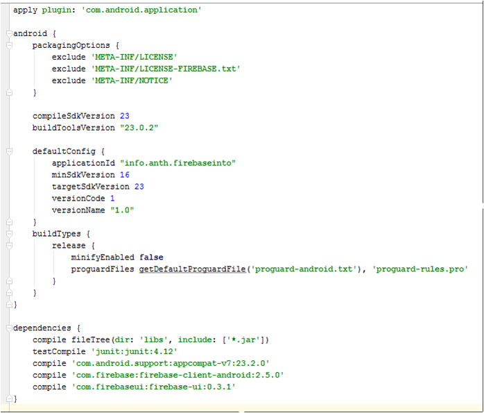
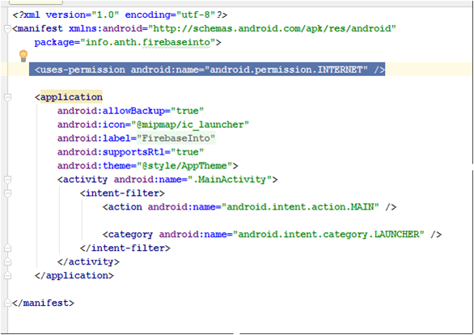
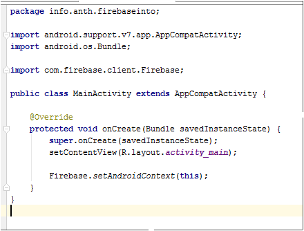
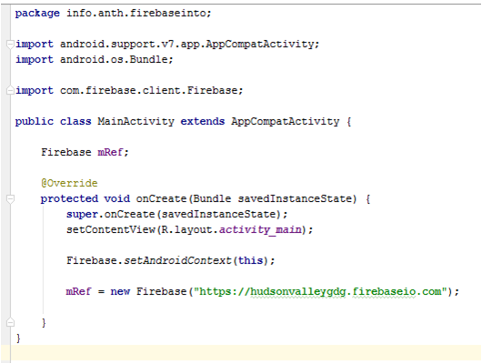
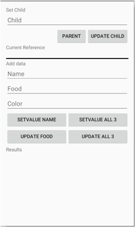

# FirebaseIntro
[Introduction to Firebase Presentation](https://drive.google.com/open?id=1Op1T8CtfSA_LebmnNNEYkaPVDeVJscpXhAXANFbw8t0)

Step by step instructions on how to create an example Android App that uses Firebase

###Step 1 Create a new Android Studio project
Empty Activity, API 16 or greater. 

###Step 2 Update build.gradle (Module:app) 
a.	Add packaging options inside of android definition 
```
android {
packagingOptions {
    exclude 'META-INF/LICENSE'
    exclude 'META-INF/LICENSE-FIREBASE.txt'
    exclude 'META-INF/NOTICE'
}
. . .
}
```

b.	Add new firebase dependencies to dependency definition 

```
dependencies {
	. . .
    compile 'com.firebase:firebase-client-android:2.5.0'
    compile 'com.firebaseui:firebase-ui:0.3.1'
}
```

###Step 3 Press Sync now – verify no errors 


###Step 4 Update AndroidManifest.xml file
add user permissions to the internet 

``<uses-permission android:name="android.permission.INTERNET" />``



###Step 5 Update MainActivity.java
Firebase Android Context code, if it doesn’t include the import firebase code add that as well 

``Firebase.setAndroidContext(this);``

(maybe)
``import com.firebase.client.Firebase;``



###Step 6	Run the app to verify no errors
###Step 7	Create Firebase Account at firebase.com 
###Step 8	Create global reference (mRef) to your Firebase database
a.	Add variable: 

``Firebase mRef;``

b.	Add assignment to your database inside onCreate method: REPLACE hudsonvalleygdg with the name of your database.

``mRef = new Firebase("https://hudsonvalleygdg.firebaseio.com");``



###Step 9 Replace activity_main.xml code:
```
<?xml version="1.0" encoding="utf-8"?>
<ScrollView xmlns:android="http://schemas.android.com/apk/res/android"
    android:layout_width="match_parent"
    android:layout_height="match_parent">

    <RelativeLayout
        android:id="@+id/main_relative_layout"
        android:layout_width="match_parent"
        android:layout_height="wrap_content"
        android:paddingBottom="@dimen/activity_vertical_margin"
        android:paddingLeft="@dimen/activity_horizontal_margin"
        android:paddingRight="@dimen/activity_horizontal_margin"
        android:paddingTop="@dimen/activity_vertical_margin">

        <TextView
            android:id="@+id/heading_text"
            android:layout_width="wrap_content"
            android:layout_height="wrap_content"
            android:text="Set Child" />

        <EditText
            android:id="@+id/edit_child"
            android:layout_width="match_parent"
            android:layout_height="wrap_content"
            android:layout_below="@id/heading_text"
            android:hint="Child" />

        <Button
            android:id="@+id/button_child"
            android:layout_width="wrap_content"
            android:layout_height="wrap_content"
            android:layout_alignEnd="@+id/edit_child"
            android:layout_alignRight="@+id/edit_child"
            android:layout_below="@+id/edit_child"
            android:text="Update Child"
            android:onClick="clickChild"/>

        <Button
            android:id="@+id/button_parent"
            android:layout_width="wrap_content"
            android:layout_height="wrap_content"
            android:layout_below="@+id/edit_child"
            android:layout_toLeftOf="@+id/button_child"
            android:layout_toStartOf="@+id/button_child"
            android:text="Parent"
            android:onClick="clickParent"/>

        <TextView
            android:id="@+id/heading_ref"
            android:layout_width="wrap_content"
            android:layout_height="wrap_content"
            android:layout_below="@+id/button_child"
            android:text="Current Reference" />

        <TextView
            android:id="@+id/text_reference"
            android:layout_width="wrap_content"
            android:layout_height="wrap_content"
            android:layout_below="@+id/heading_ref"
            />

        <TextView
            android:id="@+id/line1"
            android:layout_width="match_parent"
            android:layout_height="3dp"
            android:layout_below="@+id/text_reference"
            android:layout_marginBottom="5dp"
            android:layout_marginTop="5dp"
            android:background="#111111" />

        <TextView
            android:id="@+id/heading_add"
            android:layout_width="wrap_content"
            android:layout_height="wrap_content"
            android:layout_below="@+id/line1"
            android:text="Add data" />

        <EditText
            android:id="@+id/edit_name"
            android:layout_width="match_parent"
            android:layout_height="wrap_content"
            android:layout_below="@id/heading_add"
            android:hint="Name" />

        <EditText
            android:id="@+id/edit_food"
            android:layout_width="match_parent"
            android:layout_height="wrap_content"
            android:layout_below="@id/edit_name"
            android:hint="Food" />

        <EditText
            android:id="@+id/edit_color"
            android:layout_width="match_parent"
            android:layout_height="wrap_content"
            android:layout_below="@id/edit_food"
            android:hint="Color" />

        <LinearLayout
            android:id="@+id/layout_set"
            android:layout_width="match_parent"
            android:layout_height="wrap_content"
            android:layout_below="@+id/edit_color"
            android:orientation="horizontal">

            <Button
                android:id="@+id/button_set"
                android:layout_width="0dp"
                android:layout_height="wrap_content"
                android:layout_weight="1"
                android:text="setValue name"
                android:onClick="clickSetName"/>

            <Button
                android:id="@+id/button_set3"
                android:layout_width="0dp"
                android:layout_height="wrap_content"
                android:layout_weight="1"
                android:text="setvalue all 3"
                android:onClick="clickSet3"/>
        </LinearLayout>

        <LinearLayout
            android:id="@+id/layout_update"
            android:layout_width="match_parent"
            android:layout_height="wrap_content"
            android:layout_below="@+id/layout_set"
            android:orientation="horizontal">

            <Button
                android:id="@+id/button_update"
                android:layout_width="0dp"
                android:layout_height="wrap_content"
                android:layout_weight="1"
                android:text="update food"
                android:onClick="clickUpdateFood"/>

            <Button
                android:id="@+id/button_update3"
                android:layout_width="0dp"
                android:layout_height="wrap_content"
                android:layout_weight="1"
                android:text="update all 3"
                android:onClick="clickUpdate3"/>
        </LinearLayout>

        <TextView
            android:id="@+id/heading_results"
            android:layout_width="wrap_content"
            android:layout_height="wrap_content"
            android:layout_below="@+id/layout_update"
            android:layout_marginBottom="5dp"
            android:layout_marginTop="5dp"
            android:text="Results" />
        <TextView
            android:id="@+id/text_results"
            android:layout_width="wrap_content"
            android:layout_height="wrap_content"
            android:layout_below="@+id/heading_results"
            />
    </RelativeLayout>
</ScrollView>
```

Should look like:



###Step 11 Add empty button methods to the MainActivity class.
```
public class MainActivity extends AppCompatActivity {

	. . .

    public void clickChild(View view){
    }

    public void clickParent(View view){
    }

    public void clickSetName(View view){
    }

    public void clickSet3(View view){
    }

    public void clickUpdateFood(View view){
    }

    public void clickUpdate3(View view){
    }
}
```
###Step 12	Update the click child method. 
This method allows you to subsets of data, children, in your database. It uses the Firebase function reference.child(“<child-name>”) to update the reference. Until a value is added to the path, you will not see anything change in the database. It also uses the Firebase function reference.getRef() to show the current reference.

```
public void clickChild(View view){
    // This method moves along the children of the database
    // Each call will add a new child to the path
    //
    // In file systems terms: creating a sub-directory

    // Get the Edit Text
    EditText childEntry = (EditText) findViewById(R.id.edit_child);
    // Get reference display text field
    TextView displayRef = (TextView) findViewById(R.id.text_reference);

    // update the Firebase reference (if child has a value)
    mRef = mRef.child(childEntry.getText().toString());
    // set reference display text
    displayRef.setText(mRef.getRef().toString());

    // clear Child edit box
    childEntry.setText("");
}
```
###Step 13	Update the click parent method. 
This method moves your reference to the parent of your current reference. Stopping at the root. It uses the reference.getParent() Firebase method, and the reference.getRef() method for display. It checks to see if it is already at the root using reference.getRoot() and reference.getRef(). Nothing will be displayed in the Firebase database. 
```
public void clickParent(View view){
    // This method moves to the parent of the current reference

    // Get reference display text field
    TextView displayRef = (TextView) findViewById(R.id.text_reference);

    // Need to check if already at root.
    if (!mRef.getRef().toString().equals(mRef.getRoot().toString())) {
        // NOT at root
        // update the Firebase reference (if child has a value)
        mRef = mRef.getParent();
    }
    // set reference display text
    displayRef.setText(mRef.getRef().toString());
}
```
###Step 14	Run Program
###Step 15	Update the clickSetName and clickSet3 methods with the code below. 
This code navigates to the child and sets its value. Beware: the setValue method deletes all child nodes at its calling reference and inserts the new values. Navigating to the direct child avoids this issue.
```
public void clickSetName(View view){
    // This method saves the data for the name using the set method

    // Get the Name entry
    EditText nameEntry =  (EditText) findViewById(R.id.edit_name);

    // Navigate to the name child and set the value
    mRef.child("name").setValue(nameEntry.getText().toString());
}

public void clickSet3(View view){
    // This method saves the data for name, food, and color using the set method

    // Get the Name entry
    EditText nameEntry =  (EditText) findViewById(R.id.edit_name);
    // Get the Food entry
    EditText foodEntry =  (EditText) findViewById(R.id.edit_food);
    // Get the Name entry
    EditText colorEntry =  (EditText) findViewById(R.id.edit_color);

    // Navigate to the name child and set the value
    mRef.child("name").setValue(nameEntry.getText().toString());
    // Navigate to the food child and set the value
    mRef.child("food").setValue(foodEntry.getText().toString());
    // Navigate to the color child and set the value
    mRef.child("color").setValue(colorEntry.getText().toString());
}
```

###Step 16	Run the program. 
Changes will save to the database. Use the Firebase dashboard to see the changes. https://YOUR-DATABASE-NAME.firebaseio.com/ 

###Step 17	Replace the clickSetName and clickSet3 methods with the code below. 
This code uses Hash Maps to set key, value pairs. Beware: the setValue method deletes all child nodes at its calling reference and inserts the new values. Navigating to the direct child avoided this issue, using hash maps does not.
```
public void clickSetName(View view){
    // This method saves the data for the name using the set method

    // Get the Name entry
    EditText nameEntry =  (EditText) findViewById(R.id.edit_name);

    // Define hash map and set the values
    Map<String, Object> updateMap = new HashMap<>();
    updateMap.put("name", nameEntry.getText().toString());
    mRef.setValue(updateMap);
}

public void clickSet3(View view){
    // This method saves the data for name, food, and color using the set method

    // Get the Name entry
    EditText nameEntry =  (EditText) findViewById(R.id.edit_name);
    // Get the Food entry
    EditText foodEntry =  (EditText) findViewById(R.id.edit_food);
    // Get the Name entry
    EditText colorEntry =  (EditText) findViewById(R.id.edit_color);

    // Define hash map and set the values
    Map<String, Object> updateMap = new HashMap<>();
    updateMap.put("name", nameEntry.getText().toString());
    updateMap.put("color", colorEntry.getText().toString());
    updateMap.put("food", foodEntry.getText().toString());
    mRef.setValue(updateMap);
}
```

###Step 18	Run the program. 
Changes will save to the database. Use the Firebase dashboard to see the changes. https://YOUR-DATABASE-NAME.firebaseio.com/ Notice that clicking the SETVALUE NAME button after the SETVALUE ALL 3 will delete the color and food children. This is because the setValue() Firebase function deletes all children at the reference it is executed and then inserts the new values.

###Step 19	Update the clickUpdateFood and clickUpdate3 methods with the code below. 
This code uses hash Maps to update the child key with its value. 
```
public void clickUpdateFood(View view){
    // This method saves the data for food using the updateChildren method

    // Get the Food entry
    EditText foodEntry =  (EditText) findViewById(R.id.edit_food);

    // Define hash map and set the values
    Map<String, Object> updateMap = new HashMap<>();
    updateMap.put("food", foodEntry.getText().toString());
    mRef.updateChildren(updateMap);
}

public void clickUpdate3(View view){
    // This method saves the data for name, food, and color 
    // using the updateChildren method

    // Get the Name entry
    EditText nameEntry =  (EditText) findViewById(R.id.edit_name);
    // Get the Food entry
    EditText foodEntry =  (EditText) findViewById(R.id.edit_food);
    // Get the Name entry
    EditText colorEntry =  (EditText) findViewById(R.id.edit_color);

    // Define hash map and set the values
    Map<String, Object> updateMap = new HashMap<>();
    updateMap.put("name", nameEntry.getText().toString());
    updateMap.put("color", colorEntry.getText().toString());
    updateMap.put("food", foodEntry.getText().toString());
    mRef.updateChildren(updateMap);
}
```

###Step 20	Run the program. 
Changes will save to the database. Use the Firebase dashboard to see the changes. https://YOUR-DATABASE-NAME.firebaseio.com/

###Step 21	Setup a listener at the base reference level of the database. 
Show in the results section of screen. (Add highlighted lines)

a.	Add variables, store results TextView
```
Firebase mRefRoot;
ValueEventListener eventListener;
TextView resultsText;

@Override
protected void onCreate(Bundle savedInstanceState) {

	  . . .

    mRefRoot = mRef;
    resultsText = (TextView) findViewById(R.id.text_results);
}
```

b.	Override onResume and onPause methods

```
@Override
public void onResume() {
    super.onResume();
    eventListener = new ValueEventListener() {
        @Override
        public void onDataChange(DataSnapshot dataSnapshot) {
            Log.i("FirebaseInto", String.valueOf(dataSnapshot.getValue()));
            resultsText.setText(String.valueOf(dataSnapshot.getValue()));
        }
        @Override
        public void onCancelled(FirebaseError firebaseError) {
            Log.e("FirebaseInto", firebaseError.toString());
        }
    };
    mRefRoot.addValueEventListener(eventListener);
}

@Override
public void onPause() {
    super.onPause();
    mRefRoot.removeEventListener(eventListener);
}
```
###Step 22	Run the program. 
All database values should show in the results area. Changes directly made using the Firebase dashboard will also show: https://YOUR-DATABASE-NAME.firebaseio.com/

